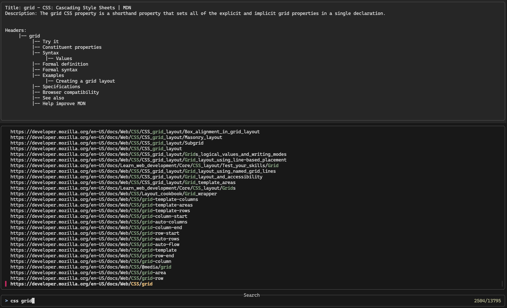

# **Barabara**

<p align="center">
</img>
</p>

_Fuzzy search MDN like a bat out of hell._

Barabara is a fast, developer-friendly tool that lets you quickly search and discover relevant documentation from [MDN Web Docs](https://developer.mozilla.org/). Inspired by Barbara Gordon (Oracle), the ultimate information broker of the DC universe, Barabara helps you navigate the web’s most trusted development resource with precision and ease.

- 🔍 **Fuzzy Find**: Instantly surface matching MDN articles by keyword or partial phrase.
- ⚡ **Fast & Lightweight**: No need to load bulky websites or navigate menus.
- 🧠 **Developer-First**: Built for CLI and app integrations to supercharge your workflow.

**Because every developer deserves their own Oracle.**

## Help

```bash
MDN Site Map Cli

Usage: barbara <COMMAND>

Commands:
fuzzy Fuzzy search for a topic on the MDN website
preview Generates a summary of a MDN page. Useful for quick reference.
help Print this message or the help of the given subcommand(s)

Options:
-h, --help Print help
```

<p align="center">
    
</p>

## Installation

This tool relies on [FZF](https://github.com/junegunn/fzf). Please make sure you have it installed before proceeding.
You can install this tool using `cargo install barbara`

## TODO

- [ ] In development, add dev option for fzf preview
- [ ] Intercept empty selection to display a suggestion
